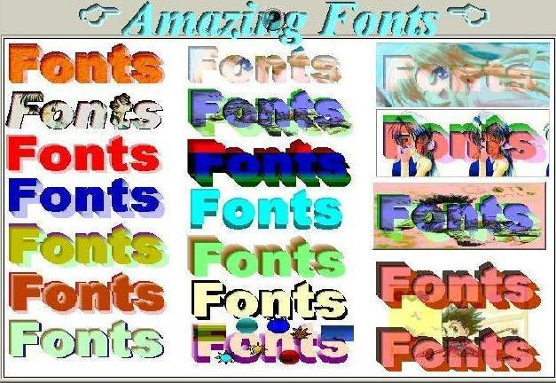



## Amazing Fonts \(u can add picture, sound, animation, effects…\)

### Description

Getting bore to your fonts…my fonts can add picture, sound, animation, effects and hyperlink. You can use any fonts you like and it’s easy to use. Please don’t forget to vote!
 
### More Info
 

             |
---                |---
**Submitted On**   |2002-03-02 18:29:44
**By**             |[Justice League](https://github.com/Planet-Source-Code/PSCIndex/blob/master/ByAuthor/justice-league.md)
**Level**          |Advanced
**User Rating**    |4.9 (49 globes from 10 users)
**Compatibility**  |VB 6\.0
**Category**       |[OLE/ COM/ DCOM/ Active\-X](https://github.com/Planet-Source-Code/PSCIndex/blob/master/ByCategory/ole-com-dcom-active-x__1-29.md)
**World**          |[Visual Basic](https://github.com/Planet-Source-Code/PSCIndex/blob/master/ByWorld/visual-basic.md)
**Archive File**   |[Amazing\_Fo59024332002\.zip](https://github.com/Planet-Source-Code/justice-league-amazing-fonts-u-can-add-picture-sound-animation-effects__1-32294/archive/master.zip)

